# StoryEngine Information Flow

Flow separates model-owned story interpretation from Python-owned input, schema, and state checks. Color-coded arrows show correction, rejection, continuation, and final-exit loops. Session changes stay in RAM and disappear when process exits.

```mermaid
flowchart LR
    U["USER<br/>one open response<br/>maximum 400 characters<br/>What will you do next, and what will you photograph?"]
    I{"CLI input validation<br/>blank or over 400?"}
    B["Correction loop<br/>reprompt same question<br/>no state change"]
    J{"Prompt injection attempt?"}
    X["Safety exit<br/>before API call<br/>exit code 2"]
    S["Read-only seed<br/>opening.txt<br/>story_memory.json"]
    M["StoryMemory<br/>current process RAM"]
    P["Build Responses request<br/>fixed instructions separate from JSON input<br/>no tools"]
    A["OpenAI Responses API<br/>gpt-5.6-luna<br/>reasoning high · verbosity low<br/>store=false · cache key storyengine-v1<br/>90 s timeout · up to 2 retries"]
    O["Structured result<br/>decision_is_realistic · end_request_detected<br/>sentence_count · story_contract_passed<br/>photo_taken · ending · story_text<br/>memory delta: set / events / resolve_threads"]
    R{"Realistic decision?"}
    N["Realism loop<br/>reprompt same question<br/>memory unchanged"]
    V{"Python contract validation<br/>Pydantic schema · 4–9 reported sentences<br/>ending consistency · photo counter<br/>delta keys / limits / retcon rules"}
    F["Safe failure exit<br/>invalid structured output<br/>memory unchanged"]
    D["Apply full delta to copy<br/>increment step<br/>update photo counter / ending marker"]
    C["Print accepted chapter<br/>stdout; progress and errors to stderr"]
    Q{"Explicit end request<br/>OR decision 9?"}
    H["Continuation loop<br/>nonfinal chapter: 4–9 sentences<br/>unresolved cliffhanger"]
    T["Final branch · 4–9 sentences<br/>protagonist drowns non-graphically<br/>OR leaves the valley"]
    Z["Story-complete exit<br/>discard RAM changes"]

    U --> I
    I -- yes --> B --> U
    I -- no --> J
    J -- yes --> X
    J -- no --> P
    S --> M --> P
    P --> A --> O --> R
    R -- no --> N --> U
    R -- yes --> V
    V -- invalid --> F --> Z
    V -- valid --> D --> C --> Q
    Q -- no --> H --> U
    Q -- yes --> T --> Z
    Z -. "next launch reloads seed" .-> S

    classDef correction fill:#fff4d6,stroke:#b88400,color:#17324d;
    classDef safety fill:#fde7eb,stroke:#c53b4b,color:#17324d;
    classDef continuation fill:#e3f0ff,stroke:#2a77c7,color:#17324d;
    classDef finalPath fill:#e2f5ed,stroke:#27815c,color:#17324d;
    class B correction;
    class X,N,F safety;
    class H continuation;
    class T,Z finalPath;
```

Figure icons: person, terminal, files, RAM, API, structured document, validation shield, camera, retry arrows, cliffhanger loop, exit marker.

## Ownership boundary

- **Model:** interpret vague decisions; classify physical realism and explicit ending requests; decide photo subject; write English story text; report sentence count, story-contract check, ending label, and memory delta.
- **Python:** reject blank, oversized, or clearly malicious input; validate typed output, sentence-count range, final/nonfinal ending consistency, memory keys and limits, retcon protection, photo-counter ownership, and all-or-nothing updates.
- **Process:** load seed canon read-only; keep accepted story changes in RAM; discard those changes on exit. No full transcript or generated memory is written to disk.
