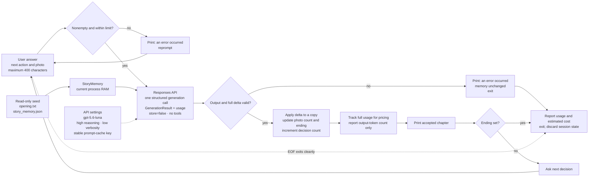

# StoryEngine Information Flow

One valid user answer produces one structured chapter. Accepted memory changes stay in process RAM and disappear when StoryEngine exits.

## Boundaries

- The model receives fixed instructions separately from JSON containing the user answer and complete memory.
- The model proposes chapter text, ending metadata, photo use, and `set` / `events` / `resolve_threads` updates.
- Python validates schema, memory limits, retcon protection, thread targets, photo count, and application-owned ending state before applying any update.
- Each successful response contributes token usage to cost tracking. At story ending or EOF, print only output-token count and estimated cost.
- `story_memory.json` never changes during a run. A new process starts again from seed canon.
- Any runtime failure prints only `an error occurred`; exception details are not shown.
- No regex scans, input-guard call, independent review call, or transcript storage exists.
