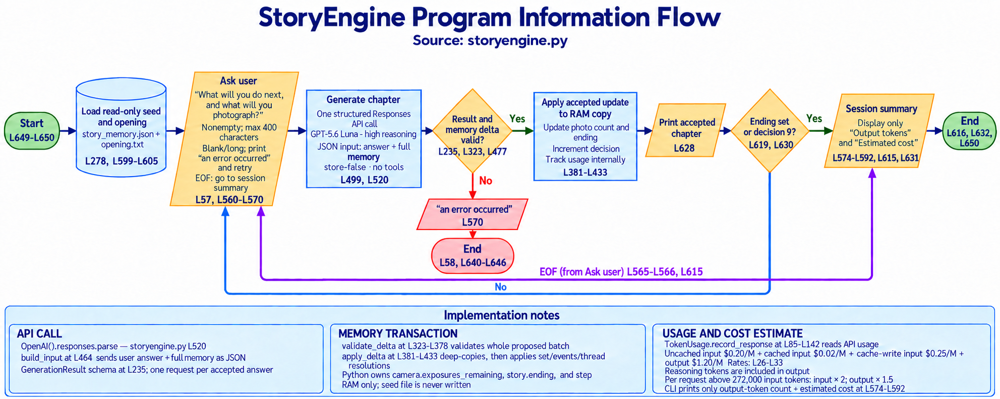

# StoryEngine Information Flow

Each node includes source line references into `storyengine.py`; update graph references when implementation lines move.

## Runtime path

1. Load `story_memory.json` as read-only seed and print `opening.txt`. Accepted changes stay in process memory.
2. Ask what the user will do next and photograph. Blank or overlength answers print `an error occurred` and reprompt. EOF closes session and reports usage if any generation completed.
3. Send one structured Responses API request with fixed instructions and JSON containing the answer and full memory.
4. Validate `GenerationResult`, ending/photo metadata, and full memory delta. Invalid output prints `an error occurred` and exits.
5. Apply accepted changes to a memory copy, track usage, and print chapter. Continue until ending or decision nine; otherwise ask again.
6. At story ending or EOF, print only output-token count and estimated cost. Exit discards session changes; next run reloads seed.

Runtime failures show only `an error occurred`. No input guard, independent review, API diagnostic, transcript store, or persistent session save exists.

## Implementation notes

- **API call:** `OpenAI().responses.parse` is at `storyengine.py:520`; `build_input` at line 464 keeps user answer and full memory in JSON. `GenerationResult` schema begins at line 235.
- **Memory transaction:** `validate_delta` checks supported operations at lines 323–378. `apply_delta` at lines 381–433 applies the validated batch to a deep copy; Python owns photo count, ending marker, and step. No partial delta reaches session state.
- **Cost estimate:** `TokenUsage.record_response` at lines 85–142 reads provider usage; rates are defined at lines 26–33. Per response, estimate uncached input at $0.20/M, cached input at $0.02/M, cache writes at $0.25/M, and output at $1.20/M. Reasoning tokens are included in output. For requests above 272,000 input tokens, input rate doubles and output rate is multiplied by 1.5.
- **Display:** `print_usage_summary` at lines 574–592 shows output-token count and estimated cost only; full usage detail remains internal for pricing.

## Flowchart convention

Graph uses ISO 5807:1985 flowchart symbols: terminators, input/output parallelograms, process rectangles, decision diamonds, stored-data cylinder, and directional flowlines. ISO describes the standard for data, program, and system flowcharts; it was confirmed current in 2019. [ISO 5807:1985](https://www.iso.org/standard/11955.html).
